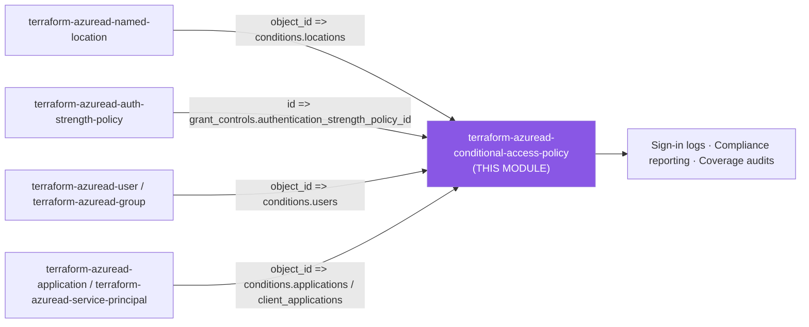
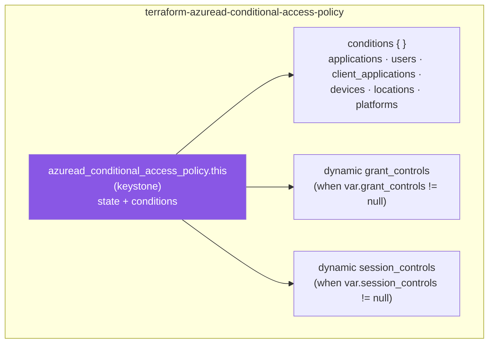

# 🛡️ Azure AD **Conditional Access Policy** Terraform Module

> **Define a single Microsoft Entra Conditional Access policy as typed, secure-by-default code** — deeply-typed `conditions` / `grant_controls` / `session_controls` schemas, every provider enum validated, Report-only by default, and a first-class break-glass exclusion to keep you from locking yourself out. Built for azuread **v3.x**.

    

---

## 🧩 Overview

This module wraps a single **`azuread_conditional_access_policy`** resource and exposes its full shape through tightly-typed `object` variables:

- 🎯 **Conditions** — scope the policy by users, groups, roles, guests/external users, applications, client app types, named locations, device filters, platforms, client (workload) applications, and sign-in / user / service-principal / insider **risk levels**.
- 🔐 **Grant controls** — require MFA, compliant device, hybrid-joined device, approved/compliant app, password change, terms of use, or an authentication strength policy — combined with `AND` / `OR`.
- ⏱️ **Session controls** — sign-in frequency, persistent browser, app-enforced restrictions, Conditional Access App Control (MCAS), and resilience defaults.
- 🚨 **Break-glass exclusions** — a dedicated `exclude_object_ids` input that merges emergency-access accounts into `excluded_users` so a broad "All users" policy can never lock every admin out.
- 🧪 **Report-only by default** — `state` defaults to `enabledForReportingButNotEnforced` so a new policy is observed in sign-in logs before it is ever enforced.

> 💡 **Why it matters:** A misconfigured "All users" Conditional Access policy is one of the few ways to lock *every* administrator out of a tenant. This module makes the safe path the default path — Report-only first, break-glass always available, and every enum checked at `plan` time.

---

## ❤️ Support this project

If these Terraform modules have been helpful to you or your organization, I'd appreciate your support in any of the following ways:

- ⭐ **Star this repository** to help others discover this Terraform module.
- 🤝 **Connect with me on LinkedIn:** [linkedin.com/in/microsoftexpert](https://www.linkedin.com/in/microsoftexpert)
- ☕ **Buy me a coffee:** [buymeacoffee.com/microsoftexpert](https://buymeacoffee.com/microsoftexpert)

Whether it's a star, a professional connection, or a coffee, every gesture helps keep these modules actively maintained and continually improving. Thank you for being part of the community!

---

## 🗺️ Where this fits in the family

This module sits downstream of several identity building-block modules — it consumes object IDs from `terraform-azuread-named-location` (locations), `terraform-azuread-auth-strength-policy` (grant controls), and user/group/application/service-principal modules (conditions targeting) as caller-supplied inputs. It has no downstream `terraform-azuread-*` consumer of its own; per SCOPE.md its outputs feed compliance reporting, sign-in log correlation, and coverage audits instead.



This module **consumes** object IDs from `terraform-azuread-named-location`, `terraform-azuread-auth-strength-policy`, and user/group/application/service-principal modules; it **emits** `object_id`/`id`/`state` for audit and compliance tooling — see the Typical wiring section below (no other `terraform-azuread-*` module consumes this policy's outputs).

---

## 🧬 What this module builds

A single resource with a deeply-nested `conditions` block and two independently-optional dynamic blocks for grant and session controls.



---

## 📁 Module Structure

```
terraform-azuread-conditional-access-policy/
├── providers.tf # azuread provider requirement (>= 2.0, < 4.0); no provider block
├── variables.tf # display_name, state, conditions, exclude_object_ids, grant_controls, session_controls, timeouts
├── main.tf # single azuread_conditional_access_policy.this — total dynamic renderer
├── outputs.tf # object_id, id, display_name, state
├── SCOPE.md # cross-module contract + Graph API permissions
└── README.md
```

---

## ⚙️ Quick Start

Smallest call that creates a real, enforceable policy — require MFA for all users, with a break-glass exclusion:

```hcl
module "ca_require_mfa" {
  source = "git::https://github.com/microsoftexpert/terraform-azuread-conditional-access-policy?ref=v1.0.0"

  display_name = "CA001-AllUsers-Require-MFA"
  state        = "enabledForReportingButNotEnforced" # Report-only first; flip to "enabled" after review

  exclude_object_ids = [var.break_glass_user_object_id] # 🚨 never omit on an "All users" policy

  conditions = {
    client_app_types = ["all"]
    applications = {
      included_applications = ["All"]
    }
    users = {
      included_users = ["All"]
    }
  }

  grant_controls = {
    operator          = "OR"
    built_in_controls = ["mfa"]
  }
}
```

> ℹ️ The module configures **no** `provider "azuread"` block — the root module supplies tenant credentials. A Conditional Access policy requires `grant_controls` **or** `session_controls` (or both); supplying neither is a validation error.

---

## 🔑 Graph API Permissions Required

The Terraform service principal must hold these **application** permissions (admin-consented) before `apply` will succeed:

| Permission | Type | Required for |
|---|---|---|
| `Policy.Read.All` | Application | Reading Conditional Access policies during `plan`/`refresh` |
| `Policy.ReadWrite.ConditionalAccess` | Application | Creating, updating, and deleting the Conditional Access policy |

> ⚠️ **Both permissions require admin consent.** There is a [documented Graph known issue](https://learn.microsoft.com/graph/known-issues#conditional-access-policy-requires-consent-to-additional-permission): creating a Conditional Access policy may additionally require consent to read permissions for the objects it references — `Application.Read.All`, `Group.Read.All`, `User.Read.All`, `RoleManagement.Read.Directory`, `Agreement.Read.All` — otherwise the create call returns `403 Forbidden`. Grant these read scopes to the SP if you reference apps, groups, roles, users, or terms-of-use by ID.
>
> ℹ️ Least-privilege Entra roles for the equivalent interactive operation are **Security Reader** (read) and **Conditional Access Administrator** (write).

---

## 🔌 Typical wiring

Derived from the SCOPE.md Emits table — the policy's `object_id` is the universal handle downstream consumers key on.

| This module output | Feeds into |
|---|---|
| `object_id` | Audit/inventory tooling, policy-coverage reports, `azuread`/Graph references that consume the policy ID, role-assignment or access-package resource associations |
| `id` | Same value as `object_id`; for callers that key on `id` |
| `display_name` | Logging, audit, change-tracking, sign-in log correlation |
| `state` | Drift/compliance checks confirming a policy is `enabled` vs `enabledForReportingButNotEnforced` |

Common **inbound** wiring (object IDs this policy consumes):

| Upstream module output | Wired into |
|---|---|
| `terraform-azuread-group.object_id` | `conditions.users.included_groups` / `excluded_groups`, and break-glass `exclude_object_ids` |
| `terraform-azuread-named-location.object_id` | `conditions.locations.included_locations` / `excluded_locations` |
| `terraform-azuread-service-principal.object_id` | `conditions.client_applications.included_service_principals` / `excluded_service_principals` |
| `terraform-azuread-application.client_id` | `conditions.applications.included_applications` / `excluded_applications` |
| `terraform-azuread-auth-strength-policy` policy ID | `grant_controls.authentication_strength_policy_id` |

---

## 🧠 Architecture Notes

- **🚨 Break-glass is non-negotiable on broad policies.** Microsoft and both require excluding at least one **cloud-only emergency-access account** from every policy that targets "All users". This module's `exclude_object_ids` is merged into `conditions.users.excluded_users` via `distinct(concat(...))`, so it composes with any exclusions you set directly. Best practice: keep 2+ break-glass accounts (credential-diverse), exclude a dedicated break-glass **group** via `conditions.users.excluded_groups`, and alert on every break-glass sign-in.
- **🧪 Report-only is the secure default.** `state` defaults to `enabledForReportingButNotEnforced`. The workflow is: deploy Report-only → review **Sign-in logs → Conditional Access** and the *What If* tool for impact → only then set `state = "enabled"`. Flipping an enforced policy back to `enabledForReportingButNotEnforced` *disables* enforcement.
- **🔗 Policies combine with AND.** When multiple policies apply to a sign-in, **all** must be satisfied. Splitting requirements across policies (one for MFA, one for compliant device) is additive, not alternative.
- **⛔ `block` stands alone.** In `grant_controls.built_in_controls`, `block` cannot be combined with any other control — block policies short-circuit enforcement.
- **👥 Built-in roles only.** `conditions.users.included_roles` / `excluded_roles` accept **built-in** directory role template IDs. Conditional Access does not evaluate custom or administrative-unit-scoped roles.
- **🪪 Workload identities are separate.** Conditional Access scoped to *users* does not block service principals. Use `conditions.client_applications` (Workload Identities Premium) to target service principals.
- **💳 Licensing gates.** Sign-in frequency and persistent browser session controls require **Entra ID P1**; risk-based conditions (`sign_in_risk_levels` / `user_risk_levels`) require **P2 / Identity Protection**; `service_principal_risk_levels` requires **Workload Identities Premium**.
- **🧱 Immutable removal of `devices`.** A `conditions.devices` block can be *added* to an existing policy, but *removing* a previously-set `devices` block forces resource recreation (provider behavior — labeled `# IMMUTABLE removal` in `variables.tf`).
- **📍 Named locations must exist first.** `conditions.locations` references named-location object IDs; create the `terraform-azuread-named-location` resources before this policy.

---

## 📚 Example Library (copy-paste)

<details>
<summary><b>1 · Minimal</b> — require MFA for all users (Report-only)</summary>

```hcl
module "ca_min" {
  source = "git::https://github.com/microsoftexpert/terraform-azuread-conditional-access-policy?ref=v1.0.0"

  display_name = "CA001-AllUsers-Require-MFA"

  conditions = {
    client_app_types = ["all"]
    applications     = { included_applications = ["All"] }
    users            = { included_users = ["All"] }
  }

  grant_controls = {
    operator          = "OR"
    built_in_controls = ["mfa"]
  }
}
```
</details>

<details>
<summary><b>2 · With break-glass exclusion</b> — mandatory pattern for "All users"</summary>

```hcl
module "ca_breakglass" {
  source = "git::https://github.com/microsoftexpert/terraform-azuread-conditional-access-policy?ref=v1.0.0"

  display_name = "CA010-AllUsers-Require-MFA-BreakGlass"
  state        = "enabled"

  # Emergency-access accounts merged into excluded_users — these can never be locked out.
  exclude_object_ids = [
    "11111111-1111-1111-1111-111111111111", # BreakGlass01 (FIDO2)
    "22222222-2222-2222-2222-222222222222", # BreakGlass02 (certificate)
  ]

  conditions = {
    client_app_types = ["all"]
    applications     = { included_applications = ["All"] }
    users = {
      included_users  = ["All"]
      excluded_groups = ["33333333-3333-3333-3333-333333333333"] # break-glass GROUP (belt and braces)
    }
  }

  grant_controls = {
    operator          = "OR"
    built_in_controls = ["mfa"]
  }
}
```
</details>

<details>
<summary><b>3 · Block legacy authentication</b></summary>

```hcl
module "ca_block_legacy" {
  source = "git::https://github.com/microsoftexpert/terraform-azuread-conditional-access-policy?ref=v1.0.0"

  display_name       = "CA002-BlockLegacyAuth"
  state              = "enabled"
  exclude_object_ids = [var.break_glass_user_object_id]

  conditions = {
    client_app_types = ["exchangeActiveSync", "other"] # legacy client app types
    applications     = { included_applications = ["All"] }
    users            = { included_users = ["All"] }
  }

  grant_controls = {
    operator          = "AND"
    built_in_controls = ["block"] # block stands alone
  }
}
```
</details>

<details>
<summary><b>4 · Require compliant or hybrid-joined device</b></summary>

```hcl
module "ca_device" {
  source = "git::https://github.com/microsoftexpert/terraform-azuread-conditional-access-policy?ref=v1.0.0"

  display_name       = "CA003-RequireCompliantDevice"
  exclude_object_ids = [var.break_glass_user_object_id]

  conditions = {
    client_app_types = ["all"]
    applications     = { included_applications = ["All"] }
    users            = { included_users = ["All"] }
    platforms        = { included_platforms = ["windows", "macOS"] }
  }

  grant_controls = {
    operator          = "OR" # satisfy ANY of the listed controls
    built_in_controls = ["compliantDevice", "domainJoinedDevice"]
  }
}
```
</details>

<details>
<summary><b>5 · Risk-based — require MFA on medium/high sign-in risk (P2)</b></summary>

```hcl
module "ca_risk" {
  source = "git::https://github.com/microsoftexpert/terraform-azuread-conditional-access-policy?ref=v1.0.0"

  display_name       = "CA004-SignInRisk-Require-MFA"
  exclude_object_ids = [var.break_glass_user_object_id]

  conditions = {
    client_app_types    = ["all"]
    applications        = { included_applications = ["All"] }
    users               = { included_users = ["All"] }
    sign_in_risk_levels = ["high", "medium"]
  }

  grant_controls = {
    operator          = "AND"
    built_in_controls = ["mfa", "passwordChange"]
  }
}
```
</details>

<details>
<summary><b>6 · Named-location scoping — block access from outside trusted locations</b></summary>

```hcl
module "ca_location" {
  source = "git::https://github.com/microsoftexpert/terraform-azuread-conditional-access-policy?ref=v1.0.0"

  display_name       = "CA005-Block-Untrusted-Locations"
  exclude_object_ids = [var.break_glass_user_object_id]

  conditions = {
    client_app_types = ["all"]
    applications     = { included_applications = ["All"] }
    users            = { included_users = ["All"] }
    locations = {
      included_locations = ["All"]
      excluded_locations = [module.trusted_hq.object_id] # terraform-azuread-named-location output
    }
  }

  grant_controls = {
    operator          = "AND"
    built_in_controls = ["block"]
  }
}
```
</details>

<details>
<summary><b>7 · Session controls — sign-in frequency + persistent browser</b></summary>

```hcl
module "ca_session" {
  source = "git::https://github.com/microsoftexpert/terraform-azuread-conditional-access-policy?ref=v1.0.0"

  display_name       = "CA006-AdminPortals-SignInFrequency"
  exclude_object_ids = [var.break_glass_user_object_id]

  conditions = {
    client_app_types = ["browser"]
    applications     = { included_applications = ["All"] }
    users            = { included_roles = ["62e90394-69f5-4237-9190-012177145e10"] } # Global Administrator template ID
  }

  session_controls = {
    sign_in_frequency        = 4
    sign_in_frequency_period = "hours"
    persistent_browser_mode  = "never"
  }

  # session_controls alone is a valid policy — grant_controls is optional here.
}
```
</details>

<details>
<summary><b>8 · Guests / external users with external-tenant scoping</b></summary>

```hcl
module "ca_guests" {
  source = "git::https://github.com/microsoftexpert/terraform-azuread-conditional-access-policy?ref=v1.0.0"

  display_name = "CA007-Guests-Require-MFA"
  state        = "enabled"

  conditions = {
    client_app_types = ["all"]
    applications     = { included_applications = ["All"] }
    users = {
      included_guests_or_external_users = {
        guest_or_external_user_types = ["b2bCollaborationGuest", "b2bCollaborationMember"]
        external_tenants = {
          membership_kind = "enumerated"
          members         = ["55555555-5555-5555-5555-555555555555"] # partner tenant ID
        }
      }
    }
  }

  grant_controls = {
    operator          = "OR"
    built_in_controls = ["mfa"]
  }
}
```
</details>

<details>
<summary><b>9 · Workload identities — block risky service principals (Workload Identities Premium)</b></summary>

```hcl
module "ca_workload" {
  source = "git::https://github.com/microsoftexpert/terraform-azuread-conditional-access-policy?ref=v1.0.0"

  display_name = "CA008-WorkloadIdentity-Block-Risk"
  state        = "enabled"

  conditions = {
    client_app_types = ["all"]
    applications     = { included_applications = ["All"] }
    users            = { included_users = ["None"] } # users out of scope; workload identities in scope
    client_applications = {
      included_service_principals = ["ServicePrincipalsInMyTenant"]
      excluded_service_principals = [module.sync_sp.object_id]
    }
    service_principal_risk_levels = ["medium", "high"]
  }

  grant_controls = {
    operator          = "AND"
    built_in_controls = ["block"]
  }
}
```
</details>

<details>
<summary><b>10 · Authentication strength policy + terms of use</b></summary>

```hcl
module "ca_authstrength" {
  source = "git::https://github.com/microsoftexpert/terraform-azuread-conditional-access-policy?ref=v1.0.0"

  display_name       = "CA009-Admins-PhishResistant-MFA"
  state              = "enabled"
  exclude_object_ids = [var.break_glass_user_object_id]

  conditions = {
    client_app_types = ["all"]
    applications     = { included_applications = ["All"] }
    users            = { included_roles = ["62e90394-69f5-4237-9190-012177145e10"] }
  }

  grant_controls = {
    operator                          = "AND"
    authentication_strength_policy_id = module.phish_resistant.id # terraform-azuread-auth-strength-policy
    terms_of_use                      = ["66666666-6666-6666-6666-666666666666"]
  }
}
```
</details>

<details>
<summary><b>11 · Device filter — exclude managed/SAW devices via rule</b></summary>

```hcl
module "ca_device_filter" {
  source = "git::https://github.com/microsoftexpert/terraform-azuread-conditional-access-policy?ref=v1.0.0"

  display_name       = "CA011-Block-NonSAW-Admin"
  exclude_object_ids = [var.break_glass_user_object_id]

  conditions = {
    client_app_types = ["all"]
    applications     = { included_applications = ["All"] }
    users            = { included_roles = ["62e90394-69f5-4237-9190-012177145e10"] }
    devices = {
      filter = {
        mode = "exclude"
        rule = "device.extensionAttribute1 -eq \"SAW\""
      }
    }
  }

  grant_controls = {
    operator          = "AND"
    built_in_controls = ["block"]
  }
}
```

> ⚠️ Device filters require the **Attribute Definition Reader** role on the Terraform SP — it is not included in Global Administrator.
</details>

<details>
<summary><b>12 · Conditional Access App Control (MCAS) session policy</b></summary>

```hcl
module "ca_mcas" {
  source = "git::https://github.com/microsoftexpert/terraform-azuread-conditional-access-policy?ref=v1.0.0"

  display_name       = "CA012-Block-Downloads-Unmanaged"
  exclude_object_ids = [var.break_glass_user_object_id]

  conditions = {
    client_app_types = ["browser"]
    applications     = { included_applications = ["Office365"] }
    users            = { included_users = ["All"] }
  }

  session_controls = {
    cloud_app_security_policy   = "blockDownloads"
    disable_resilience_defaults = false
  }
}
```
</details>

<details>
<summary><b>13 · Production-ready — -compliant admin MFA baseline</b></summary>

```hcl
module "ca_admin_baseline" {
  source = "git::https://github.com/microsoftexpert/terraform-azuread-conditional-access-policy?ref=v1.0.0"

  display_name = "CA100-Admins-Require-MFA-CompliantDevice"
  state        = "enabledForReportingButNotEnforced" # validate in Report-only, then promote

  exclude_object_ids = [
    module.break_glass_01.object_id,
    module.break_glass_02.object_id,
  ]

  conditions = {
    client_app_types = ["all"]
    applications     = { included_applications = ["All"] }
    users = {
      included_roles  = ["62e90394-69f5-4237-9190-012177145e10"] # Global Administrator
      excluded_groups = [module.break_glass_group.object_id]
    }
  }

  grant_controls = {
    operator          = "AND"
    built_in_controls = ["mfa", "compliantDevice"]
  }

  session_controls = {
    sign_in_frequency        = 12
    sign_in_frequency_period = "hours"
  }
}
```
</details>

<details>
<summary><b>14 · Hardened — block all access except compliant device + phishing-resistant MFA</b></summary>

```hcl
module "ca_hardened" {
  source = "git::https://github.com/microsoftexpert/terraform-azuread-conditional-access-policy?ref=v1.0.0"

  display_name = "CA200-AllUsers-Hardened"
  state        = "enabledForReportingButNotEnforced"

  exclude_object_ids = [
    module.break_glass_01.object_id,
    module.break_glass_02.object_id,
  ]

  conditions = {
    client_app_types = ["all"]
    applications     = { included_applications = ["All"] }
    users = {
      included_users  = ["All"]
      excluded_groups = [module.break_glass_group.object_id]
      excluded_guests_or_external_users = {
        guest_or_external_user_types = ["serviceProvider"]
        external_tenants             = { membership_kind = "all" }
      }
    }
    sign_in_risk_levels = ["low", "medium", "high"]
    user_risk_levels    = ["medium", "high"]
  }

  grant_controls = {
    operator                          = "AND"
    authentication_strength_policy_id = module.phish_resistant.id
    built_in_controls                 = ["compliantDevice"]
  }

  session_controls = {
    sign_in_frequency                         = 1
    sign_in_frequency_period                  = "hours"
    persistent_browser_mode                   = "never"
    application_enforced_restrictions_enabled = true
    disable_resilience_defaults               = true
  }
}
```
</details>

<details>
<summary><b>15 · Cross-module wiring — named location + group + policy</b></summary>

```hcl
module "trusted_hq" {
  source       = "git::https://github.com/microsoftexpert/terraform-azuread-named-location?ref=v1.0.0"
  display_name = "-HQ-Trusted-IPs"
  #... ip ranges...
}

module "break_glass_group" {
  source       = "git::https://github.com/microsoftexpert/terraform-azuread-group?ref=v1.0.0"
  display_name = "SEC-BreakGlass-Accounts"
}

module "ca_location_gated" {
  source = "git::https://github.com/microsoftexpert/terraform-azuread-conditional-access-policy?ref=v1.0.0"

  display_name = "CA300-MFA-Outside-HQ"

  conditions = {
    client_app_types = ["all"]
    applications     = { included_applications = ["All"] }
    users = {
      included_users  = ["All"]
      excluded_groups = [module.break_glass_group.object_id] # consume group object_id
    }
    locations = {
      included_locations = ["All"]
      excluded_locations = [module.trusted_hq.object_id] # consume named_location object_id
    }
  }

  grant_controls = {
    operator          = "OR"
    built_in_controls = ["mfa"]
  }
}
```
</details>

---

## 📦 Inputs (high-level)

**Identity**
- `display_name` *(string, required)* — friendly policy name shown in the Microsoft Entra admin center; use a naming standard, e.g. `CA001-AllUsers-Require-MFA`. Empty/whitespace rejected by validation.

**Enforcement state**
- `state` *(string, default `"enabledForReportingButNotEnforced"`)* — one of `enabled`, `disabled`, `enabledForReportingButNotEnforced`. **Secure default = Report-only.**

**Scope**
- `conditions` *(object, required)* — scope of the policy. `client_app_types`, `applications`, and `users` are mandatory; `sign_in_risk_levels`, `user_risk_levels`, `service_principal_risk_levels`, `insider_risk_levels`, `authentication_flow_transfer_methods`, `client_applications`, `devices`, `locations`, and `platforms` are optional. Full schema below.

**Break-glass**
- `exclude_object_ids` *(list(string), default `[]`)* — 🚨 break-glass user object IDs, merged into `conditions.users.excluded_users`. Strongly recommended for any policy that includes "All" users or applications.

**Access controls — at least one of the following two is required**
- `grant_controls` *(object, default `null`)* — MFA / device / app / terms-of-use / auth-strength requirements.
- `session_controls` *(object, default `null`)* — sign-in frequency, persistent browser, MCAS, app-enforced restrictions, resilience defaults.

**Tail**
- `timeouts` *(object, default `{}`)* — optional `create` / `read` / `update` / `delete` operation timeouts.

<details>
<summary><b>Full <code>conditions</code> object schema</b></summary>

```hcl
conditions = object({
  client_app_types                     = list(string)           # REQUIRED, non-empty: all, browser, mobileAppsAndDesktopClients, exchangeActiveSync, easSupported, other
  sign_in_risk_levels                  = optional(list(string)) # low, medium, high, hidden, none, unknownFutureValue (P2)
  user_risk_levels                     = optional(list(string)) # low, medium, high, hidden, none, unknownFutureValue (P2)
  service_principal_risk_levels        = optional(list(string)) # low, medium, high, none, unknownFutureValue (Workload Identities Premium)
  insider_risk_levels                  = optional(string)       # minor, moderate, elevated, unknownFutureValue
  authentication_flow_transfer_methods = optional(list(string)) # authenticationTransfer, deviceCodeFlow

  applications = object({                          # REQUIRED block
    included_applications = optional(list(string)) # app (client) IDs, or "All" / "None" / "Office365" (XOR with included_user_actions)
    excluded_applications = optional(list(string))
    included_user_actions = optional(list(string))                             # urn:user:registerdevice, urn:user:registersecurityinfo
    filter                = optional(object({ mode = string, rule = string })) # mode: include | exclude
  })

  users = object({                           # REQUIRED block — at least one included_* must be set
    included_users  = optional(list(string)) # user object IDs, or "None" / "All" / "GuestsOrExternalUsers"
    excluded_users  = optional(list(string)) # break-glass merged in via exclude_object_ids
    included_groups = optional(list(string))
    excluded_groups = optional(list(string))
    included_roles  = optional(list(string)) # built-in directory role template IDs only
    excluded_roles  = optional(list(string))
    included_guests_or_external_users = optional(object({
      guest_or_external_user_types = list(string)                                                                     # b2bCollaborationGuest, b2bCollaborationMember, b2bDirectConnectUser, internalGuest, none, otherExternalUser, serviceProvider, unknownFutureValue
      external_tenants             = optional(object({ membership_kind = string, members = optional(list(string)) })) # membership_kind: all | enumerated | unknownFutureValue
    }))
    excluded_guests_or_external_users = optional(object({
      guest_or_external_user_types = list(string)
      external_tenants             = optional(object({ membership_kind = string, members = optional(list(string)) }))
    }))
  })

  client_applications = optional(object({
    included_service_principals = optional(list(string)) # SP object IDs, or "ServicePrincipalsInMyTenant"
    excluded_service_principals = optional(list(string))
    filter                      = optional(object({ mode = string, rule = string }))
  }))

  devices = optional(object({ # IMMUTABLE removal forces recreation
    filter = optional(object({ mode = string, rule = string }))
  }))

  locations = optional(object({
    included_locations = list(string) # named_location object IDs, or "All" / "AllTrusted"
    excluded_locations = optional(list(string))
  }))

  platforms = optional(object({
    included_platforms = list(string) # all, android, iOS, linux, macOS, windows, windowsPhone, unknownFutureValue
    excluded_platforms = optional(list(string))
  }))
})
```
</details>

<details>
<summary><b>Full <code>grant_controls</code> and <code>session_controls</code> schemas</b></summary>

```hcl
grant_controls = object({
  operator                          = string                 # REQUIRED: AND | OR
  built_in_controls                 = optional(list(string)) # block, mfa, approvedApplication, compliantApplication, compliantDevice, domainJoinedDevice, passwordChange, unknownFutureValue
  custom_authentication_factors     = optional(list(string))
  terms_of_use                      = optional(list(string))
  authentication_strength_policy_id = optional(string)
})
# At least one of built_in_controls / terms_of_use / custom_authentication_factors / authentication_strength_policy_id is required.

session_controls = object({
  application_enforced_restrictions_enabled = optional(bool, false)
  cloud_app_security_policy                 = optional(string) # blockDownloads, mcasConfigured, monitorOnly, unknownFutureValue
  disable_resilience_defaults               = optional(bool, false)
  persistent_browser_mode                   = optional(string) # always | never
  sign_in_frequency                         = optional(number)
  sign_in_frequency_authentication_type     = optional(string, "primaryAndSecondaryAuthentication")
  sign_in_frequency_interval                = optional(string, "timeBased") # timeBased | everyTime
  sign_in_frequency_period                  = optional(string)              # hours | days; required when sign_in_frequency is set
})
```
</details>

---

## 🧾 Outputs

**Primary**
- `object_id` *(string)* — Object ID (GUID) of the Conditional Access policy — the primary handle. For this resource the `id` **is** the object ID.
- `id` *(string)* — Same value as `object_id`; for callers that key on `id`.

**Metadata**
- `display_name` *(string)* — The policy's display name.
- `state` *(string)* — Enforcement state: `enabled`, `disabled`, or `enabledForReportingButNotEnforced`.

> ℹ️ This resource exposes **no credential material** — there are no `sensitive` or write-only outputs. No output is conditionally `null`.

---

## 🧱 Design Principles

- **Type is the contract** — every provider block and enum is mirrored in a deeply-typed `object`; a malformed input fails at `plan`, not at the Graph API.
- **Secure by default** — Report-only `state`, no implicit broad scope, break-glass exclusion first-class.
- **Total renderer** — `main.tf` is pure projection: `dynamic` blocks for every optional/repeating block, `try(x, null)` on every optional nested field.
- **Validated enums** — `validation {}` blocks cover every closed value set plus cross-field rules (XOR app/user-actions, at-least-one included target, at-least-one grant/session control, `sign_in_frequency_period` required with `sign_in_frequency`).
- **Tenant-scoped** — no `resource_group_name`; Conditional Access is a tenant-level object.

---

## 🚀 Runbook

```powershell
cd C:\GitHubCode\newazureadmodules\terraform-azuread-conditional-access-policy
terraform init -backend=false
terraform validate
terraform fmt -check
```

> ⚠️ **No `plan` / `apply` offline.** Conditional Access management requires live tenant credentials (tenant_id + a service principal with the Graph permissions above). The offline gate (`init -backend=false` + `validate` + `fmt -check`) confirms structural correctness only. Test `apply` in a **non-production** tenant.

---

## 🔍 Troubleshooting

| Symptom | Cause & fix |
|---|---|
| `403 Forbidden` on create, even with `Policy.ReadWrite.ConditionalAccess` | Known Graph issue — creating a policy that references apps/groups/roles/users/terms-of-use also requires consent to the matching **read** scopes (`Application.Read.All`, `Group.Read.All`, `User.Read.All`, `RoleManagement.Read.Directory`, `Agreement.Read.All`). Grant and admin-consent them on the Terraform SP. |
| `Insufficient privileges` only when a `filter` is set | Device/application/client-application **filters** require the **Attribute Definition Reader** role — not included in Global Administrator. Assign it separately. |
| Policy created but never takes effect | `state` is `enabledForReportingButNotEnforced` (the default). Review Sign-in logs → Conditional Access, then set `state = "enabled"`. |
| Admins locked out after enabling an "All users" policy | A broad policy with no break-glass exclusion. Sign in with an excluded emergency-access account, then add `exclude_object_ids`. **Never deploy an "All users" policy without it.** |
| Policy change doesn't apply immediately | Conditional Access and group-membership changes replicate to resource providers (Exchange Online, SharePoint Online) within ~2 hours (optimized) and up to ~24 hours otherwise. Force immediate effect by revoking the user's refresh tokens (`Revoke-MgUserSignInSession`). |
| `Error:... must be one of:...` at plan time | A `validation {}` block caught an out-of-set enum (e.g. wrong-case `compliantdevice`). The message lists every legal value. |
| `At least one of grant_controls or session_controls must be specified` | A policy with neither is invalid — add a `grant_controls` or `session_controls` block. |
| `exactly one of included_applications or included_user_actions` | `conditions.applications` requires precisely one of these two — they are mutually exclusive. |
| Removing a `devices` block plans a destroy/recreate | Provider behavior — a previously-set `devices` block is immutable on removal. Expected; schedule the recreate. |
| `building client: unable to obtain access token` | No live tenant credentials — expected offline. Configure the provider/auth in the root for real `plan`/`apply`. |
| Service principals not blocked by a user-scoped policy | Conditional Access scoped to *users* does not cover workload identities — use `conditions.client_applications` (Workload Identities Premium). |

---

## 🔗 Related Docs

- [azuread_conditional_access_policy (Terraform Registry)](https://registry.terraform.io/providers/hashicorp/azuread/latest/docs/resources/conditional_access_policy)
- [Plan a Conditional Access deployment](https://learn.microsoft.com/entra/identity/conditional-access/plan-conditional-access)
- [Conditional Access report-only mode](https://learn.microsoft.com/entra/identity/conditional-access/concept-conditional-access-report-only)
- [Manage emergency access (break-glass) accounts](https://learn.microsoft.com/entra/identity/role-based-access-control/security-emergency-access)
- [Microsoft Graph known issues — Conditional Access consent](https://learn.microsoft.com/graph/known-issues#identity-and-access)
- `SCOPE.md` (this module) — cross-module contract and Graph API permissions

---

> 💙 *"Infrastructure as Code should be standardized, consistent, and secure."*
